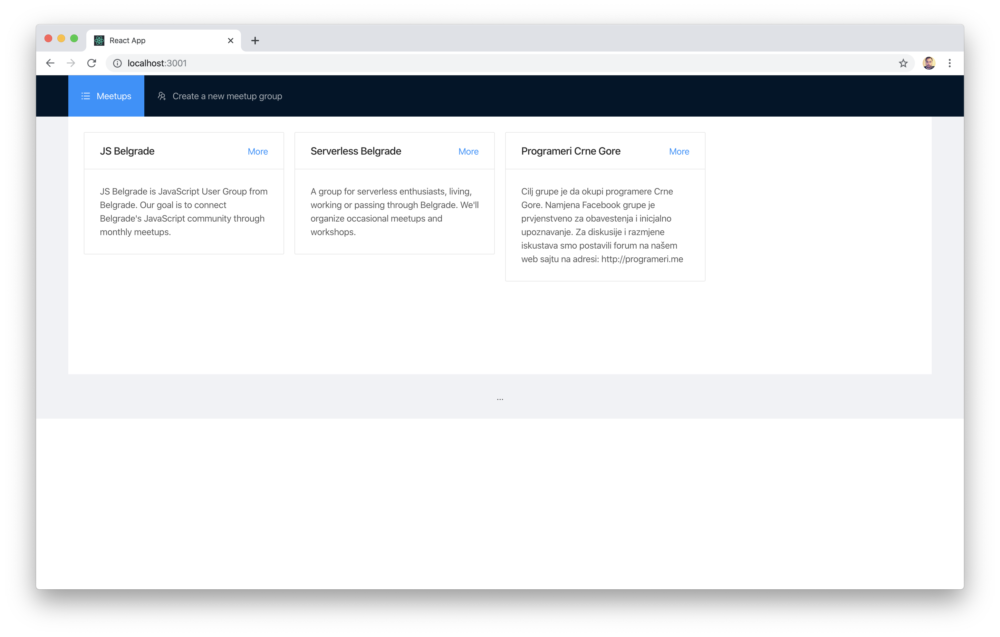

# Exercise 2: Pull all meetups

Your next task is to show the list of all meetups.

## Task

Show a list of all meetups. Pull the list from the mock API you build in the first part of the workshop.

There's no special design you should follow, but the client provided the following mockup:

### Hints

- UI is not important, feel free to make something not so pretty.
- You can use `fetch` to get the data from the API.
- No need to think about pagination at the moment.