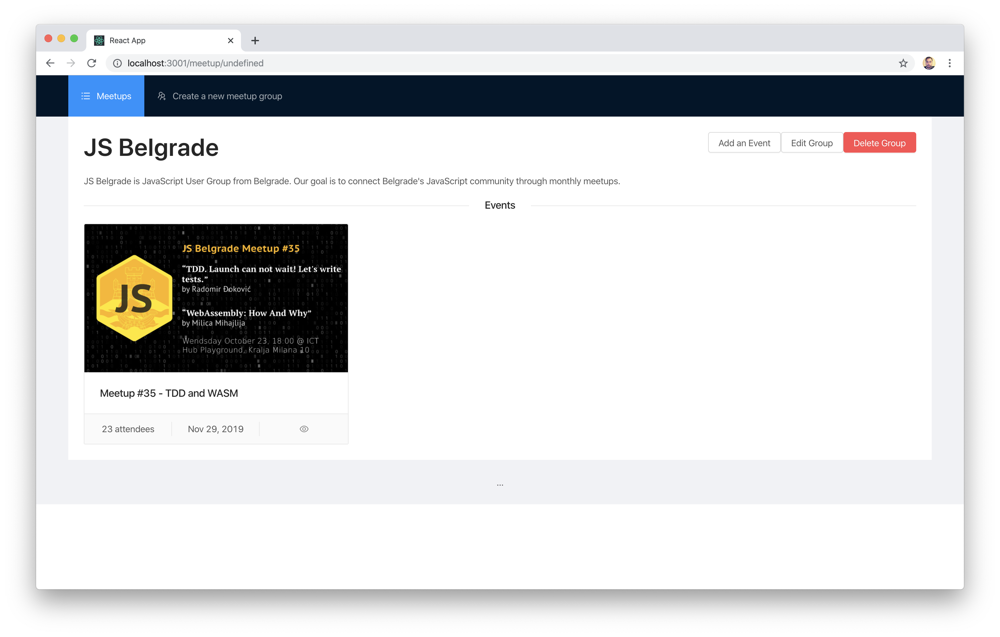

# Exercise 3: See the meetup details

Show the details for the selected meetup.

## Task

Once user clicks on a single meetup from the list, you need to show the meetup details. Pull the data about the meetup from the mock API you build in the first part of the workshop.

There's no special design you should follow, but the client provided the following mockup:

### Hints

- UI is not important, feel free to make something not so pretty.
- You can use `fetch` to get the data from the API.