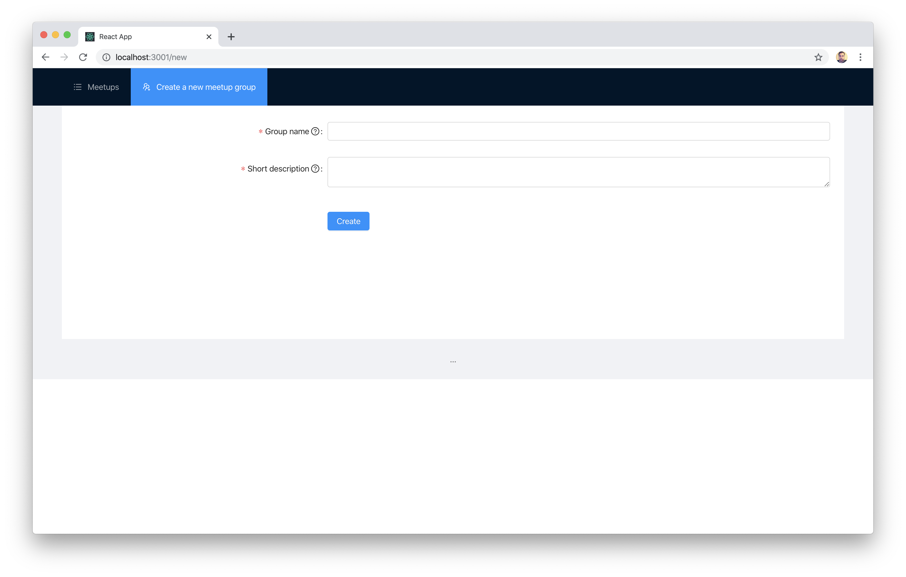

# Exercise 4: Post a new meetup

Show a for for adding a new meetup.

## Task

Users need to be able to add meetups, so you need to create a new meetup form. Once the form is submitted, the data should be sent to the mock API you build in the first part of the workshop.

For the sake of simplicity, assume that the name of the group will be also entered in this form.

There's no special design you should follow, but the client provided the following mockup:

