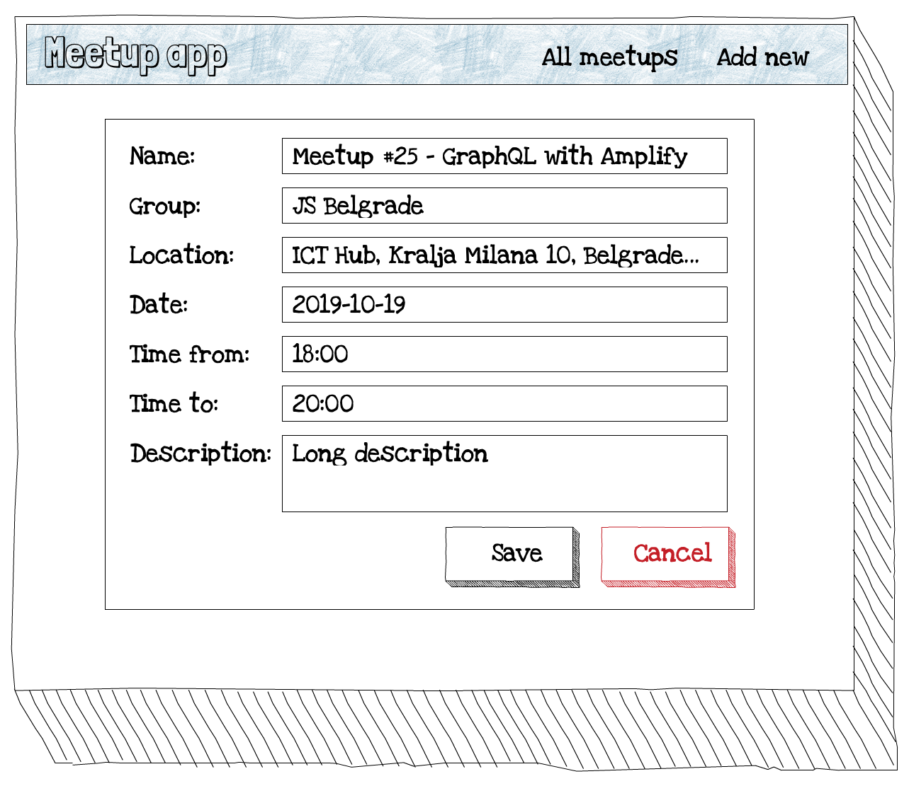

# Exercise 5: Update a meetup

Allow user to edit a meetup.

## Task

From the meetup details screen, users can click to the edit button to edit the meetup. Edit form should look similar to new meetup form, but it need to be prefilled. Once the form is submitted, the data should be sent to the mock API you build in the first part of the workshop.

For the sake of simplicity, assume that the name of the group will be also entered in this form.

There's no special design you should follow, but the client provided the following mockup:

